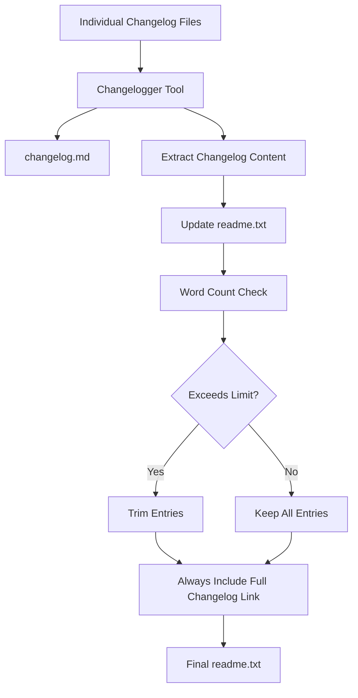

# Process Changelog Action

A comprehensive GitHub Action for processing changelog entries in WordPress plugin repositories. This composite action processes changelogs for WordPress plugin releases with automatic version detection and date formatting. It handles the generation and management of changelog files, including automatic trimming for `readme.txt` files to comply with WordPress plugin directory requirements. The action integrates with the plugin's versioning system and supports both generation and amendment of changelog entries.

## Overview

This action consolidates individual changelog entries into formatted changelog files and manages the changelog sections in both `changelog.md` and `readme.txt` files. It includes intelligent trimming capabilities to ensure the `readme.txt` changelog section stays within specified word limits while preserving the most recent entries.

## Features

- **Changelog Generation**: Processes individual changelog files into consolidated `changelog.md`.
- **README Integration**: Updates `readme.txt` with formatted changelog entries.
- **Smart Trimming**: Automatically trims `readme.txt` changelog section when it exceeds word limits.
- **Section-Based Removal**: Removes complete release entries (not partial content) when trimming.
- **Configurable Links**: Adds customizable "See changelog for all versions" links.
- **Multiple Action Types**: Supports generating new changelogs, amending existing ones, or updating versions.
- **Automatic Version Detection**: Integrates with the plugin's versioning system and formats release dates.
- **Cross-Platform**: Works on Linux and macOS environments.

## Inputs

| Input | Description | Required | Default |
|-------|-------------|----------|---------|
| `release-version` | The release version for changelog generation (e.g., `4.5.0`) or 'figure-it-out' to auto-detect | ✅ | `figure-it-out` |
| `release-date` | Release date in human-readable format (supports YYYY-MM-DD, 'today', etc.) | ❌ | `today` |
| `action-type` | Type of changelog operation (`generate`, `amend`, `amend-version`) | ❌ | `generate` |
| `target-branch` | Target branch for the workflow | ❌ | `main` |
| `changelog-full-url` | URL for "See changelog for all versions" link (can be overridden by `package.json`) | ❌ | `https://evnt.is/1b5k` |
| `additional-inputs` | Additional inputs (JSON string) | ❌ | `'{}'` |

### Action Types

- **`generate`**: Creates new changelog entries from individual changelog files
- **`amend`**: Updates existing changelog entries for the same version
- **`amend-version`**: Updates only the version header without processing changelog files

## Outputs

| Output | Description | Type |
|--------|-------------|------|
| `changelog` | Escaped changelog content for use in other actions | String |
| `changelog-content` | The new changelog entry that was generated | String |
| `changes-made` | Whether any changes were made | Boolean |

## How It Works

### 1. Changelog Processing Flow



### 2. README.txt Trimming Logic

The action includes sophisticated trimming capabilities for `readme.txt` files:

- **Word Count Analysis**: Counts words in changelog section (excluding headers)
- **Section-Based Trimming**: Removes complete release entries, not partial content
- **Oldest-First Removal**: Trims from bottom (oldest entries) to preserve newest content
- **Boundary Detection**: Uses precise line number analysis to extract complete entries
- **Link Addition**: Appends configurable "See changelog for all versions" link

### 3. File Processing

#### changelog.md

- Generated/updated using the Jetpack Changelogger tool
- Contains complete changelog history
- Never trimmed or modified by word count limits

#### readme.txt

- Changelog section updated with new entries
- New entries are prepended (newest at top)
- Automatically trimmed if exceeds 5,000 words (configurable)
- Maintains all other sections unchanged

## Usage Examples

### Basic usage (auto-detect version)

```yaml
- name: Process changelog
  uses: the-events-calendar/actions/.github/actions/process-changelog@main
```

### With specific version

```yaml
- name: Process changelog
  uses: the-events-calendar/actions/.github/actions/process-changelog@main
  with:
    release-version: '6.2.0'
    release-date: '2024-01-15'
```

### Custom Configuration

```yaml
- name: Process Changelog with Custom Settings
  uses: the-events-calendar/actions/.github/actions/process-changelog@main
  with:
    release-version: "5.14.0"
    release-date: "2024-03-15"
    action-type: "generate"
    changelog-full-url: "https://example.com/full-changelog"
    target-branch: "develop"
```

### Amend existing changelog

```yaml
- name: Amend changelog
  uses: the-events-calendar/actions/.github/actions/process-changelog@main
  with:
    action-type: 'amend'
    release-version: '6.1.5'
```

### Complete release workflow

```yaml
name: Process Release Changelog
on:
  workflow_dispatch:
    inputs:
      version:
        description: 'Release version (leave empty to auto-detect)'
        required: false
        default: ''
      action:
        description: 'Action type'
        required: true
        default: 'generate'
        type: choice
        options:
        - generate
        - amend

jobs:
  process-changelog:
    runs-on: ubuntu-latest
    outputs:
      changelog: ${{ steps.process.outputs.changelog-content }}
    steps:
      - name: Process changelog
        id: process
        uses: the-events-calendar/actions/.github/actions/process-changelog@main
        with:
          release-version: ${{ github.event.inputs.version || 'figure-it-out' }}
          action-type: ${{ github.event.inputs.action }}

      - name: Display results
        run: |
          echo "Changelog processed!"
          echo "Content: ${{ steps.process.outputs.changelog-content }}"
```

### Integration with other actions

```yaml
- name: Analyze changes first
  id: analyze
  uses: the-events-calendar/actions/.github/actions/analyze-changes@main

- name: Process changelog if changes detected
  if: steps.analyze.outputs.changes-detected == 'true'
  uses: the-events-calendar/actions/.github/actions/process-changelog@main
  with:
    release-version: 'figure-it-out'
    action-type: 'generate'
```

## Integration Features

### Version Auto-Detection

- **Smart Detection**: Automatically finds version from `.puprc` configuration
- **Multiple Sources**: Supports various version file formats and regex patterns
- **Validation**: Ensures version follows semantic versioning (x.y.z or x.y.z.w)

### Date Handling

- **Human-Readable Input**: Accepts dates like "today", "2024-01-15", "next Friday"
- **Automatic Formatting**: Converts to YYYY-MM-DD format for consistency
- **Flexible Parsing**: Uses `date` command for robust date parsing

### Integration Action Types

- **Generate**: Creates new changelog entries from pending changes
- **Amend**: Modifies existing changelog entries for a specific version

### Integration Dependencies

- **PHP Environment**: Sets up PHP 7.4 with Composer
- **Git Integration**: Configures Git for potential commits
- **Basic Setup**: Uses shared setup action for consistent environment

## Dependencies

### Required Files

- `bin/process-changelog.sh` - Main processing script
- `bin/trim-readme-changelog.sh` - readme.txt trimming utility
- `bin/class-tec-changelog-formatter.php` - Custom changelog formatter
- `vendor/bin/changelogger` - Jetpack Changelogger tool
- `package.json` - Version information
- `.puprc` - Project configuration

### Required Tools

- **PHP 7.4+** - For Changelogger tool
- **Composer** - For PHP dependencies
- **Bash** - For shell scripts
- **Standard Unix tools** - `awk`, `sed`, `grep`, `wc`

## Configuration

### Project Setup

Ensure your project has the following structure:

```text
project-root/
├── changelog/              # Individual changelog files
│   ├── .gitkeep
│   └── feature-xyz.md
├── bin/                    # Processing scripts
│   ├── process-changelog.sh
│   └── readme-changelog-trimmer.sh
├── package.json           # Version information
├── readme.txt            # WordPress plugin readme
├── changelog.md          # Generated changelog
├── .puprc                 # Plugin configuration (used by pup)
└── composer.json         # Changelogger dependency
```

### Version Detection

The action reads version information from `.puprc` configuration:

#### Example .puprc structure

```json
{
  "paths": {
    "versions": [
      {
        "file": "package.json",
        "regex": "\"version\":\\s*\"([^\"]+)\""
      },
      {
        "file": "plugin-file.php",
        "regex": "Version:\\s*([\\d\\.]+)"
      }
    ]
  }
}
```

### Version Detection Process

1. Checks if `.puprc` file exists
2. Validates `paths.versions` configuration
3. Iterates through version sources
4. Extracts version using provided regex
5. Returns first valid version found

### Plugin Configuration (package.json)

Each plugin can configure its changelog URL in the `package.json` file. Add a `tec` section with `changelog_url`:

```json
{
  "name": "your-plugin-name",
  "version": "1.0.0",
  "tec": {
    "changelog_url": "https://evnt.is/your-plugin-changelog"
  },
  "dependencies": {...}
}
```

**Configuration Priority:**

1. **`package.json`** - Plugin-specific configuration (recommended)
2. **Action parameter** - Workflow-level override
3. **Default value** - `https://evnt.is/1b5k` fallback

**Example Plugin Configurations:**

```json
// The Events Calendar
{
  "tec": {
    "changelog_url": "https://evnt.is/1b5k"
  }
}

// Event Tickets
{
  "tec": {
    "changelog_url": "https://evnt.is/1b5t"
  }
}

// Events Pro
{
  "tec": {
    "changelog_url": "https://evnt.is/1b5p"
  }
}
```

### Changelog Files

Individual changelog files should follow this format:

```markdown
Significance: patch
Type: fix

Fixed issue with event display on mobile devices
```

## Date Processing

### Supported Date Formats

```yaml
# Absolute dates
release-date: '2024-01-15'
release-date: '2024/01/15'

# Relative dates
release-date: 'today'
release-date: 'tomorrow'
release-date: 'next Friday'
release-date: '+7 days'

# Default
release-date: 'today'  # Default if not specified
```

### Output Format

All dates are converted to `YYYY-MM-DD` format for consistency.

## Trimming Behavior

### Word Count Limits

- **Default Limit**: 5,000 words for `readme.txt` changelog section
- **Configurable**: Can be adjusted via script parameters
- **Smart Counting**: Excludes release headers and formatting from word count

### Trimming Strategy

1. **Preserve Newest**: Always keeps the most recent changelog entries
2. **Complete Entries**: Never creates partial/broken release entries
3. **Boundary Respect**: Uses release headers (`= [VERSION] DATE =`) as boundaries

### Example Trimming Result

**Before Trimming** (>5,000 words):

```text
= [5.14.0] 2024-03-15 =
...content...

= [5.13.0] 2024-02-15 =
...content...

= [5.12.0] 2024-01-15 =
...content...
```

**After Trimming** (<5,000 words):

```text
= [5.14.0] 2024-03-15 =
...content...

= [5.13.0] 2024-02-15 =
...content...

[See changelog for all versions](https://evnt.is/1b5k)
```

## Migration from Reusable Workflow

This action replaces the `process-changelog.yml` reusable workflow.

### Before (Reusable Workflow)

```yaml
uses: ./.github/workflows/reusable/release-process/process-changelog.yml
with:
  release-version: '6.2.0'
  release-date: 'today'
  action-type: 'generate'
  target-branch: 'main'
```

### After (Composite Action)

```yaml
uses: the-events-calendar/actions/.github/actions/process-changelog@main
with:
  release-version: '6.2.0'
  release-date: 'today'
  action-type: 'generate'
  target-branch: 'main'
```

### Key Differences

1. **Usage**: Direct action call instead of workflow call
2. **Setup**: Uses `basic-setup` action instead of workflow
3. **Outputs**: Access through step outputs instead of job outputs

## Integration

This action is designed to be used within release workflows and integrates seamlessly with:

- **Release Preparation**: Version bumping workflows
- **Translation Sync**: POT file generation workflows
- **Branch Management**: Merge forward workflows
- **Pull Request Automation**: Automated changelog processing

## Best Practices

### Version Management

```yaml
# Let the action auto-detect version
- uses: the-events-calendar/actions/.github/actions/process-changelog@main
  with:
    release-version: 'figure-it-out'

# Or specify explicitly for releases
- uses: the-events-calendar/actions/.github/actions/process-changelog@main
  with:
    release-version: ${{ github.event.inputs.version }}
```

### Conditional Processing

```yaml
- name: Check if changelog needed
  id: check
  run: |
    if [ "$(ls -A changelog)" != "" ]; then
      echo "needs-processing=true" >> $GITHUB_OUTPUT
    fi

- name: Process changelog
  if: steps.check.outputs.needs-processing == 'true'
  uses: the-events-calendar/actions/.github/actions/process-changelog@main
```

### Error Recovery

```yaml
- name: Process changelog
  id: process
  continue-on-error: true
  uses: the-events-calendar/actions/.github/actions/process-changelog@main

- name: Handle failure
  if: steps.process.outcome == 'failure'
  run: |
    echo "Changelog processing failed, using manual process"
    # Fallback logic here
```

## Output Examples

### Success Output

```yaml
# Output values
changelog-content: "Changelog processed for version 6.2.0 on 2024-01-15"
changes-made: "true"
```

### With Custom Summary

If the underlying `process-changelog` action provides a summary:

```yaml
changelog-content: "Generated changelog for 6.2.0 with 15 entries"
changes-made: "true"
```

## Error Handling

The action includes comprehensive error handling for:

- Missing required files (`readme.txt`, `package.json`, `.puprc`)
- Invalid changelog file formats
- File permission issues
- Malformed version numbers
- Empty changelog directories

### Missing .puprc File

```text
Error: .puprc file not found
```

**Solution**: Ensure `.puprc` configuration file exists in repository root.

### Missing paths.versions

```text
Error: paths.versions not found in .puprc
```

**Solution**: Add version configuration to `.puprc` file.

### Version Detection Failure

If auto-detection fails, the action will continue but may not have a valid version.
**Solution**: Specify `release-version` explicitly.

## Troubleshooting

### Common Issues

1. **No changelog files found**
   - Ensure `changelog/` directory contains `.md` files
   - Check file permissions and formatting

2. **Changelogger fails**
   - Verify Composer dependencies are installed
   - Check PHP version compatibility

3. **readme.txt not updated**
   - Verify `readme.txt` exists and has `== Changelog ==` section
   - Check file write permissions

4. **Trimming not working**
   - Verify release headers follow exact format: `= [VERSION] DATE =`
   - Check word count calculation logic

### Composer Issues

- Ensure `composer.json` exists and is valid
- Check PHP version compatibility
- Verify network access for dependency downloads

### Git Configuration Issues

- Check repository permissions
- Ensure Git is properly configured
- Verify branch access

### Date Parsing Errors

- Use standard date formats
- Check locale settings if using relative dates
- Verify `date` command availability

### Version Detection Problems

- Validate `.puprc` JSON syntax
- Check file paths in version configuration
- Ensure regex patterns are correct
- Test regex patterns manually

### Debug Mode

Add debug output by modifying the shell scripts temporarily:

```bash
set -x  # Enable debug mode
echo "DEBUG: Processing changelog section..."
```

## Contributing

When modifying this action:

1. Test with various changelog configurations
2. Verify trimming logic with different word counts
3. Ensure cross-platform compatibility (Linux/macOS)
4. Update documentation for any new features
5. Test error handling scenarios
