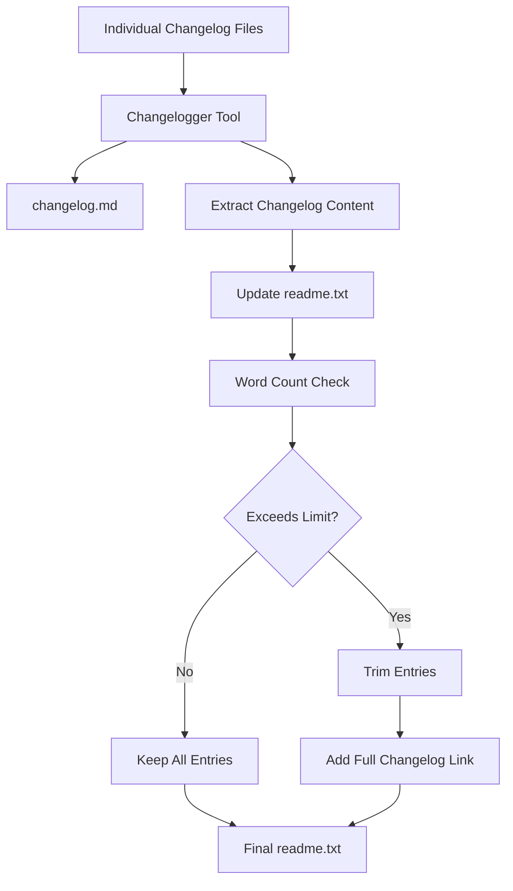

# Process Changelog Action

A comprehensive GitHub Action for processing changelog entries in WordPress plugin repositories. This action handles the generation and management of changelog files, including automatic trimming for `readme.txt` files to comply with WordPress plugin directory requirements.

## Overview

This action consolidates individual changelog entries into formatted changelog files and manages the changelog sections in both `changelog.md` and `readme.txt` files. It includes intelligent trimming capabilities to ensure the `readme.txt` changelog section stays within specified word limits while preserving the most recent entries.

## Features

- **Changelog Generation**: Processes individual changelog files into consolidated `changelog.md`
- **README Integration**: Updates `readme.txt` with formatted changelog entries
- **Smart Trimming**: Automatically trims `readme.txt` changelog section when it exceeds word limits
- **Section-Based Removal**: Removes complete release entries (not partial content) when trimming
- **Configurable Links**: Adds customizable "See changelog for all versions" links when trimming occurs
- **Multiple Action Types**: Supports generating new changelogs, amending existing ones, or updating versions
- **Cross-Platform**: Works on Linux and macOS environments

## Inputs

| Input | Description | Required | Default |
|-------|-------------|----------|---------|
| `release-version` | The release version for changelog generation (e.g., `4.5.0`) | ✅ | - |
| `release-date` | Release date in YYYY-MM-DD format | ❌ | `unreleased` |
| `action-type` | Type of changelog operation (`generate`, `amend`, `amend-version`) | ❌ | `generate` |
| `changelog-full-url` | URL for "See changelog for all versions" link (can be overridden by `package.json`) | ❌ | `https://evnt.is/1b5k` |

### Action Types

- **`generate`**: Creates new changelog entries from individual changelog files
- **`amend`**: Updates existing changelog entries for the same version
- **`amend-version`**: Updates only the version header without processing changelog files

## Outputs

| Output | Description |
|--------|-------------|
| `changelog` | Escaped changelog content for use in other actions |

## How It Works

### 1. Changelog Processing Flow



### 2. README.txt Trimming Logic

The action includes sophisticated trimming capabilities for `readme.txt` files:

- **Word Count Analysis**: Counts words in changelog section (excluding headers)
- **Section-Based Trimming**: Removes complete release entries, not partial content
- **Oldest-First Removal**: Trims from bottom (oldest entries) to preserve newest content
- **Boundary Detection**: Uses precise line number analysis to extract complete entries
- **Link Addition**: Adds configurable "See changelog for all versions" link when trimming occurs

### 3. File Processing

#### changelog.md

- Generated/updated using the Jetpack Changelogger tool
- Contains complete changelog history
- Never trimmed or modified by word count limits

#### readme.txt

- Changelog section updated with new entries
- New entries are prepended (newest at top)
- Automatically trimmed if exceeds 5,000 words (configurable)
- Maintains all other sections unchanged

## Usage Examples

### Basic Usage

```yaml
- name: Process Changelog
  uses: the-events-calendar/actions/.github/actions/process-changelog@main
  with:
    release-version: "5.14.0"
    release-date: "2024-03-15"
```

### Custom Configuration

```yaml
- name: Process Changelog with Custom Settings
  uses: the-events-calendar/actions/.github/actions/process-changelog@main
  with:
    release-version: "5.14.0"
    release-date: "2024-03-15"
    action-type: "generate"
    changelog-full-url: "https://example.com/full-changelog"
```

### Amend Existing Version

```yaml
- name: Amend Changelog
  uses: the-events-calendar/actions/.github/actions/process-changelog@main
  with:
    release-version: "5.14.0"
    action-type: "amend"
```

## Dependencies

### Required Files

- `bin/process-changelog.sh` - Main processing script
- `bin/trim-readme-changelog.sh` - readme.txt trimming utility
- `bin/class-tec-changelog-formatter.php` - Custom changelog formatter
- `vendor/bin/changelogger` - Jetpack Changelogger tool
- `package.json` - Version information
- `.puprc` - Project configuration

### Required Tools

- **PHP 7.4+** - For Changelogger tool
- **Composer** - For PHP dependencies
- **Bash** - For shell scripts
- **Standard Unix tools** - `awk`, `sed`, `grep`, `wc`

## Configuration

### Project Setup

Ensure your project has the following structure:

```text
project-root/
├── changelog/              # Individual changelog files
│   ├── .gitkeep
│   └── feature-xyz.md
├── bin/                    # Processing scripts
│   ├── process-changelog.sh
│   └── readme-changelog-trimmer.sh
├── package.json           # Version information
├── readme.txt            # WordPress plugin readme
├── changelog.md          # Generated changelog
├── .puprc                 # Plugin configuration (used by pup)
└── composer.json         # Changelogger dependency
```

### Plugin Configuration (package.json)

Each plugin can configure its changelog URL in the `package.json` file. Add a `tec` section with `changelog_url`:

```json
{
  "name": "your-plugin-name",
  "version": "1.0.0",
  "tec": {
    "changelog_url": "https://evnt.is/your-plugin-changelog"
  },
  "dependencies": {...}
}
```

**Configuration Priority:**

1. **`package.json`** - Plugin-specific configuration (recommended)
2. **Action parameter** - Workflow-level override
3. **Default value** - `https://evnt.is/1b5k` fallback

**Example Plugin Configurations:**

```json
// The Events Calendar
{
  "tec": {
    "changelog_url": "https://evnt.is/1b5k"
  }
}

// Event Tickets
{
  "tec": {
    "changelog_url": "https://evnt.is/1b5t"
  }
}

// Events Pro
{
  "tec": {
    "changelog_url": "https://evnt.is/1b5p"
  }
}
```

### Changelog Files

Individual changelog files should follow this format:

```markdown
Significance: patch
Type: fix
Entry: Fixed issue with event display on mobile devices
Comment: Resolves mobile responsiveness problems
```

## Error Handling

The action includes comprehensive error handling for:

- Missing required files (`readme.txt`, `package.json`, `.puprc`)
- Invalid changelog file formats
- File permission issues
- Malformed version numbers
- Empty changelog directories

## Trimming Behavior

### Word Count Limits

- **Default Limit**: 5,000 words for `readme.txt` changelog section
- **Configurable**: Can be adjusted via script parameters
- **Smart Counting**: Excludes release headers and formatting from word count

### Trimming Strategy

1. **Preserve Newest**: Always keeps the most recent changelog entries
2. **Complete Entries**: Never creates partial/broken release entries
3. **Boundary Respect**: Uses release headers (`= [VERSION] DATE =`) as boundaries
4. **Link Addition**: Automatically adds "See changelog for all versions" link when trimming occurs

### Example Trimming Result

**Before Trimming** (>5,000 words):

```text
= [5.14.0] 2024-03-15 =
...content...

= [5.13.0] 2024-02-15 =
...content...

= [5.12.0] 2024-01-15 =
...content...
```

**After Trimming** (<5,000 words):

```text
= [5.14.0] 2024-03-15 =
...content...

= [5.13.0] 2024-02-15 =
...content...

[See changelog for all versions](https://evnt.is/1b5k)
```

## Integration

This action is designed to be used within release workflows and integrates seamlessly with:

- **Release Preparation**: Version bumping workflows
- **Translation Sync**: POT file generation workflows
- **Branch Management**: Merge forward workflows
- **Pull Request Automation**: Automated changelog processing

## Troubleshooting

### Common Issues

1. **No changelog files found**
   - Ensure `changelog/` directory contains `.md` files
   - Check file permissions and formatting

2. **Changelogger fails**
   - Verify Composer dependencies are installed
   - Check PHP version compatibility

3. **readme.txt not updated**
   - Verify `readme.txt` exists and has `== Changelog ==` section
   - Check file write permissions

4. **Trimming not working**
   - Verify release headers follow exact format: `= [VERSION] DATE =`
   - Check word count calculation logic

### Debug Mode

Add debug output by modifying the shell scripts temporarily:

```bash
set -x  # Enable debug mode
echo "DEBUG: Processing changelog section..."
```

## Contributing

When modifying this action:

1. Test with various changelog configurations
2. Verify trimming logic with different word counts
3. Ensure cross-platform compatibility (Linux/macOS)
4. Update documentation for any new features
5. Test error handling scenarios
